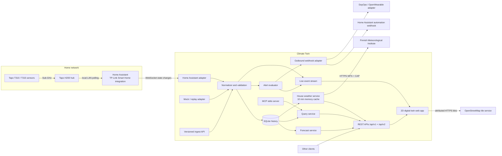
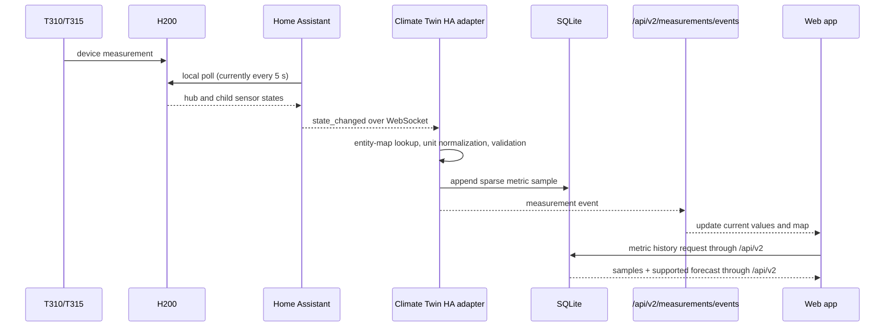

# Climate Twin architecture

Climate Twin is a local-first digital twin for observing environmental
measurements across one or more homes. Temperature and relative humidity are the
initial use case, not the storage model: a registry describes CO2 and other
finite numeric scalar measurements. TP-Link/Tapo equipment and Home Assistant
remain replaceable adapters, so history, visualisation, alerts, replay, and
integrations do not depend on a particular sensor vendor or a fixed metric list.

## Design goals

- Keep telemetry and floor plans on the user's own machine by default.
- Show new readings quickly while retaining queryable history independently of
  Home Assistant's recorder retention.
- Represent several houses, floors, rooms, sensors, manual observations, and
  static building properties without hard-coded labels or locale assumptions.
- Use one versioned contract for the web app and external clients.
- Degrade clearly: live, reconnecting, stale, and replay data must not be
  visually confused.
- Keep ingestion, storage, prediction, alerts, and presentation modular so a
  production deployment can replace one piece without rewriting the others.

## Runtime view

The browser does not talk to Home Assistant, TP-Link, or FMI directly. The API
owns credentials, normalisation, retention, alert evaluation, FMI retrieval,
weather caching, and reconnect logic. The location picker's attributed map
tiles are the one direct third-party browser flow; browser geolocation remains
disabled. See [FMI weather and house location](weather.md) for that privacy
boundary.
In the default Docker deployment an Nginx web service serves the static app and
reverse-proxies `/api/*` to the API, including the server-sent event stream.

## Data flow

"Near real-time" is deliberately not called "instantaneous." Home Assistant's
official TP-Link integration is a **local polling** integration and currently
polls devices every five seconds. End-to-end freshness is therefore the device
sampling delay plus that polling interval, network/processing time, and browser
delivery. Climate Twin can stream a Home Assistant state change immediately
after receiving it, but cannot make the upstream sensor or integration update
more frequently. The UI must display timestamps and stale state rather than
implying otherwise.

## Domain and storage model

The shared TypeScript contracts define the stable domain vocabulary:

- `House` contains floors and may contain a WGS84 `location` used only for
  house-scoped outdoor context; a `Floor` contains dimensions, walls, rooms,
  and an optional background drawing.
- `Sensor` has floor-local `(x, y)` placement and an absolute metre-based `z`
  height, plus room, model, tags, enabled state, and optional Home Assistant
  entity bindings keyed by measurement ID. Floor elevation uses the same
  vertical origin.
- `MeasurementDefinition` is the registry entry for a stable metric ID. It owns
  localized labels, canonical unit, precision and valid/display ranges, colour
  scale, interpolation settings, and spatial/forecast capability flags. The
  built-ins are temperature in °C, relative humidity in %, and CO2 in ppm.
- `MeasurementSample` stores one sensor, one registered metric, one finite
  numeric value, canonical unit, UTC source timestamp, source (`mock`,
  `home-assistant`, `api`, or `replay`), and quality. Metrics from the same
  sensor are deliberately sparse and asynchronous; a CO2 update does not copy
  or re-timestamp temperature or humidity.
- `Reading` remains the required temperature/humidity tuple used by `/api/v1`.
  It is a compatibility projection, not the normalized v2 storage contract.
- `StaticParameter` adds building context such as wall material, HVAC type,
  insulation, window orientation, or room volume without changing telemetry.
- `ManualObservation` records a leak, condensation, mould, ventilation event,
  maintenance action, or note at a house/floor/sensor/coordinate.
- `AlertRule` and `AlertEvent` separate desired policy from its lifecycle.
- `MeasurementForecastPoint` includes one registered metric's point estimate
  and low/high bounds so uncertainty can be rendered instead of hidden. A
  definition may explicitly opt out of forecasting.
- `HouseWeather` is a non-persisted FMI context view with the request location,
  provider/attribution, fetch and forecast issue times, selected observation
  station, current values, hourly forecast, CAP warnings, stale state, and a
  list of independently unavailable upstream parts.

SQLite is the intermediate source of truth for this MVP. Metric samples use an
entity-attribute-value table keyed by sensor, metric, timestamp, and source;
temperature and humidity rows written through the compatibility API are also
projected into that table. Existing legacy rows are idempotently unpivoted into
temperature/humidity samples during migration, so reopening the database does
not duplicate them. A single writer with
WAL mode is a good fit for a home deployment and makes backup a file-level
operation after a checkpoint or a SQLite online backup. House location metadata
is stored with the house; fetched weather values remain in process memory and
are not added to measurement history. All stored timestamps are UTC ISO-8601;
a house timezone controls display and calendar grouping.

Retention is configured with `RETENTION_DAYS`. Sample count grows per metric:
ten sensors × three metrics every five seconds is about 15.6 million metric
samples per 30-day month. Deletion should run in bounded batches, longer views
need downsampling, and database compaction should be an explicit maintenance
operation, not part of a request. See [Security and privacy](security-privacy.md)
for retention and backup guidance.

## Live, history, replay, and prediction semantics

- **Live:** normalized metric samples are persisted first, then emitted. Each
  metric retains its own timestamp/source/quality. A client reconnect should
  refresh snapshots/history rather than assume it saw every event.
- **History:** v2 API queries read one metric's persisted samples in a caller-selected
  range. Long ranges should be downsampled in later releases while raw data
  remains available within retention.
- **Replay:** persisted or mock readings are emitted on a virtual clock. Replay
  has source `replay`, must not be written back as if it were a new physical
  measurement, and must not trigger real outbound notifications unless the user
  explicitly enables a safe test sink.
- **Prediction:** forecasts are derived views with intervals and model metadata,
  never sensor facts. If `forecastSupported` is false, the UI and API show no
  forecast rather than fabricate one. See
  [Predictive maintenance](predictive-maintenance.md).
- **Spatial view:** only definitions with `spatialInterpolation` enabled produce
  an estimated field. The 2D plan renders a floor field as soft hotspot clouds;
  the orbitable 3D view interpolates a bounded XYZ volume across fresh positioned
  samples and depth-sorts its translucent blobs. Dashed vectors follow the
  strongest supported high-to-low scalar gradients, including vertical and
  diagonal components only when sensor-height coverage supports them. Regions
  far from a reporting sensor are masked rather than confidently extrapolated.
  Other metrics remain available as positioned markers and history. These cues
  are sparse-sample estimates, never measured airflow or a building-physics
  simulation.

## Module boundaries

| Module | Owns | Must not own |
| --- | --- | --- |
| Source adapters | Home Assistant, mock, replay, API ingestion | UI layout or database-specific queries |
| Measurement registry | stable IDs, labels, units, ranges, display and capability metadata | sensor samples or site-specific thresholds |
| Normalizer | entity mapping, canonical units, validation, quality | vendor credentials or forecast policy |
| Repository | schema, transactions, retention queries | HTTP or visualisation |
| Alert engine | rule evaluation and event lifecycle | delivery-specific secrets |
| Forecast service | features, forecast output, uncertainty | presenting forecasts as facts |
| Weather adapter | FMI WFS/CAP retrieval, source mapping, station/warning provenance, bounded cache | browser map tiles or indoor measurement history |
| REST/SSE transport | versioning, validation, errors, live fan-out | Home Assistant device protocol |
| MCP server | tool schemas and domain-service calls | direct database access |
| Web app | accessible interaction and rendering | secrets or authoritative storage |

Adapters depend inward on domain services. Domain services depend on repository
interfaces, not on HTTP, Home Assistant, or a rendering library. The web client
already renders a lightweight stacked-floor 3D projection from these shared
coordinates; the same boundaries support a future PostgreSQL/time-series
repository, MQTT adapter, or imported-model renderer without changing the
public concepts.

## Reliability and observability

The compatibility health endpoint is `GET /api/v1/health`; integration status is
exposed by the versioned API. Operationally important signals are connection state, last
Home Assistant event time, mapped entity count, ingest/validation errors,
database errors, SSE clients, alert delivery attempts, forecast age, configured
weather locations, last successful FMI fetch, and FMI error state.

Recommended failure behaviour:

1. Reconnect Home Assistant WebSocket with capped exponential backoff and jitter.
2. After reconnect, retain durable latest values and reconcile the current
   mapped Home Assistant states without inventing missing historical samples.
3. De-duplicate on sensor, metric, source timestamp, and source where an adapter
   can repeat an event. A second metric at the same sensor/time/source remains a
   distinct sample.
4. Persist alert state before delivery; retry only idempotent webhook deliveries
   with a stable event ID.
5. Mark each metric sample and its UI representation stale independently after
   a configured freshness threshold.

The Home Assistant adapter fetches initial mapped states and resumes the event
stream with capped reconnect backoff. Generic measurement mappings ingest each
metric independently and preserve the entity's `last_updated` time. Temperature
accepts Celsius and normalizes Fahrenheit/Kelvin to Celsius; CO2 accepts ppm, or
an explicit ppb binding can scale by 0.001 to ppm. Other custom mappings must
already use the definition's canonical unit unless an explicit configured
linear conversion is provided. The
legacy temperature/humidity keys remain available for `/api/v1` compatibility.
See [Known MVP limitations](known-limitations.md) before enabling physical ingest.

## Accessibility and internationalisation

Canvas/SVG/3D views are enhancements, not the only representation. Each view
should have a keyboard-operable sensor list/table conveying the same current
values, timestamps, alerts, and selections. Do not encode state by colour alone;
respect reduced motion; expose chart summaries; preserve focus; and target WCAG
2.2 AA. Labels, date/number formats, unit display, and thresholds belong in
locale/configuration data rather than source-code strings.

## Source references

- [Home Assistant: TP-Link Smart Home](https://www.home-assistant.io/integrations/tplink/)
  documents H200, T310, and T315 support, local polling, and the current five
  second update interval.
- [Home Assistant WebSocket API](https://developers.home-assistant.io/docs/api/websocket/)
  documents authentication and event subscriptions.
- [Home Assistant REST API](https://developers.home-assistant.io/docs/api/rest/)
  documents bearer authentication and entity state reads.
- [FMI open data manual](https://en.ilmatieteenlaitos.fi/open-data-manual)
  documents the WFS download interface and stored queries.
- [FMI CAP warning guide](https://www.ilmatieteenlaitos.fi/varoitusten-latauspalvelun-pikaohje)
  documents the current-warning Atom feeds and CAP 1.2 profile.
- [OpenStreetMap tile policy](https://operations.osmfoundation.org/policies/tiles/)
  documents attribution, identification, caching, and privacy obligations for
  the standard map tiles.

Product and integration behaviour was checked on 2026-07-14; verify upstream
documentation again when upgrading Home Assistant, sensor firmware, FMI
products, or the map layer.
