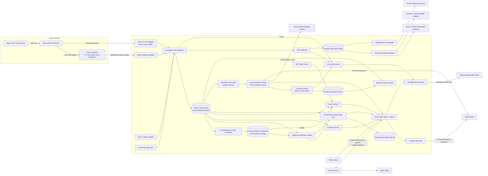
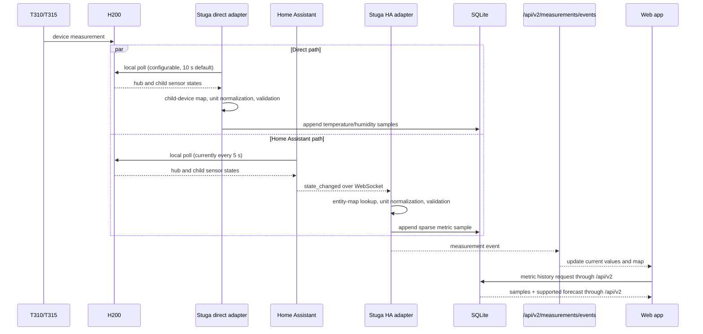

# Stuga architecture

Stuga is a local-first digital twin for observing environmental
measurements across one or more homes. Temperature and relative humidity are the
initial use case, not the storage model: a registry describes CO2 and other
finite numeric scalar measurements. TP-Link/Tapo equipment and Home Assistant
remain replaceable adapters, so history, visualisation, alerts, replay, and
integrations do not depend on a particular sensor vendor or a fixed metric list.

## Design goals

- Keep telemetry and floor plans on the user's own machine by default.
- Show new readings quickly while retaining queryable history independently of
  Home Assistant's recorder retention.
- Represent several Homes, floors, rooms, sensors, manual observations, and
  static building properties without hard-coded labels or locale assumptions.
- Use one versioned contract for the web app and external clients.
- Degrade clearly: live, reconnecting, stale, and replay data must not be
  visually confused.
- Keep ingestion, storage, prediction, alerts, and presentation modular so a
  production deployment can replace one piece without rewriting the others.

## Runtime view

The browser does not talk to Home Assistant, TP-Link, FMI, or Open-Meteo
directly. The API owns credentials, normalisation, retention, alert evaluation,
provider selection, weather/location-service retrieval, caching, and reconnect
logic. The location picker's attributed OpenStreetMap tiles are the one direct
third-party browser flow and are loaded only after an explicit action. Browser
geolocation is requested only after **Use this device's location**; the selected
coordinates then flow through the API. See
[Outdoor weather and home location](weather.md) for those privacy boundaries.
Telegram is an explicit, per-rule server-side outbound flow. Apple Notes is not
a server integration: a user-run Shortcut calls a Home-scoped bridge and then
creates or reads a note on the device. Stuga never receives an Apple Account
credential and remains the canonical maintenance record.
In the default Docker deployment an Nginx web service serves the static app and
reverse-proxies `/api/*` to the API, including the server-sent event stream.

The HTTP boundary resolves a built-in local account from a server-managed
HttpOnly session. One installation has one workspace. The API enforces roles
and property/house/area grants for every list, detail, history, and mutation
request; Guest mutations are rejected. The MCP server is a separate privileged
local process and does not use browser sessions.

The web information architecture follows ownership. Workspace navigation holds
**Overview**, **Properties**, and **Alerts**. A selected Property owns its
**Property**, **Maintenance**, and **Electricity** destinations, including
land-only Properties. A selected Home owns **Home**, **Sensors**, and **Set up**;
Activity and Outdoor are Home-scoped operational subviews. **Set up** has four
deep-linkable, keyboard-operable sections: **Overview** for readiness,
**Homes** for placement/orientation, **Connections** for that Home's TP-Link and
Home Assistant connections, and **Weather** for the Home's location/timezone and
automatic-provider summary. Current conditions, warnings, and the 48-hour
forecast belong on Outdoor rather than crowding **Set up**. Canonical URLs retain
Property and optional Home scope across refresh, Back/Forward, and copied links.

Overview and Alerts share one explainable Home-monitoring selector. It applies
the same freshness and quality gates as Home Pulse before presenting a Home as
currently monitored. Its ordered states are `action-required`, `unknown`,
`inspection-recommended`, and `monitoring-ok`: an unresolved warning or critical
alert wins, missing/stale coverage prevents an all-clear, and aging data or an
informational alert recommends inspection. Coverage requires the metrics used
by enabled rules and declared sensor bindings; battery-only telemetry is not
proof of indoor conditions. Estimated-only evidence and a disconnected adapter
that supplied current samples recommend inspection rather than producing a
confirmed state. Acknowledgement records that someone
saw an alert; it does not resolve the underlying condition. Surfaces show the
blocking alert or coverage gap instead of deriving an opaque readiness score.

Manual observations are mutable current records backed by append-only revision
snapshots. Their observed time and precision are independent of immutable
server-recorded time. SQLite uses optimistic revisions, validates
house/floor/sensor context, and retains actor attribution. An explicit
open/resolved lifecycle requires a resolution outcome, records resolution time
on the server, and preserves resolved/reopened transitions in those snapshots. See
[Manual observations and evidence time](observations.md).

Maintenance tasks are a Property-owned revisioned aggregate rather than another
observation state. They may target a Home/floor or Property area/equipment and
carry an explicit trust basis, priority, planned and due calendar dates,
same-Home observation links, and independent work
completion and verification evidence. Completing a task never mutates linked
observations. SQLite uses normalized link tables, optimistic revisions, and
append-only actor-attributed snapshots. See
[Activity and maintenance work](maintenance.md).

Electricity contract configuration and raw/effective price history are also
Property-owned; consumption sensors and Home Assistant/direct TP-Link
connections remain Home-owned. Telegram delivery configuration is owned by the
Workspace rather than any Property or Home.

## Data flow

"Near real-time" is deliberately not called "instantaneous." Both TP-Link
paths poll locally: Stuga's direct interval defaults to ten seconds and
Home Assistant's official integration currently polls every five seconds.
End-to-end freshness is the device sampling delay plus the chosen polling path,
network/processing time, and browser delivery. Stuga cannot make the
upstream sensor update more frequently. The UI must display timestamps and
stale state rather than implying otherwise.

## Domain and storage model

The shared TypeScript contracts define the stable domain vocabulary:

- `House` contains floors, an IANA timezone, and may contain a WGS84 `location`
  used only for house-scoped outdoor context. Location metadata can retain its
  country code, discovery source/confidence/time, and whether a user overrode
  the suggestion. Its optional `orientationDegrees` is the
  clockwise true-north bearing of the floor plan's top edge; absence means
  unknown. A `Floor` contains dimensions, walls, rooms, and an optional
  background drawing.
- `Sensor` has floor-local `(x, y)` placement and an absolute metre-based `z`
  height, plus room, model, tags, enabled state, and optional Home Assistant
  entity bindings keyed by measurement ID. Floor elevation uses the same
  vertical origin.
- `MeasurementDefinition` is the registry entry for a stable metric ID. It owns
  localized labels, canonical unit, precision and valid/display ranges, colour
  scale, interpolation settings, and spatial/forecast capability flags. The
  built-ins are temperature in °C, relative humidity in %, and CO2 in ppm.
- `MeasurementSample` stores one sensor, one registered metric, one finite
  numeric value, canonical unit, UTC source timestamp, source (`mock`,
  `home-assistant`, `api`, or `replay`), and quality. Metrics from the same
  sensor are deliberately sparse and asynchronous; a CO2 update does not copy
  or re-timestamp temperature or humidity.
- `Reading` remains the required temperature/humidity tuple used by `/api/v1`.
  It is a compatibility projection, not the normalized v2 storage contract.
- `StaticParameter` adds building context such as wall material, HVAC type,
  insulation, window orientation, or room volume without changing telemetry.
- `ManualObservation` records a leak, condensation, mould, ventilation event,
  maintenance action, or note at a house/floor/sensor/coordinate.
- `MaintenanceTask` plans work independently of evidence, classifies why it is
  proposed, links same-house observations, and records completion and
  verification as separate server-timed lifecycle steps.
- `AlertRule` and `AlertEvent` separate desired policy from its lifecycle.
- `MeasurementForecastPoint` includes one registered metric's point estimate
  and low/high bounds so uncertainty can be rendered instead of hidden. A
  definition may explicitly opt out of forecasting.
- `HouseWeather` is a provider-neutral response view with the request location,
  provider/attribution, fetch and forecast issue times, optional observation
  station, current values, hourly forecast, warnings, stale state, and a list of
  independently unavailable upstream parts. Per-component status distinguishes
  availability, coverage, and whether an empty result is authoritative.
- `WeatherUpdateEvent` wraps an accepted `HouseWeather` snapshot with a stable
  event ID, publication time, and scheduled/on-demand trigger. It is the
  contract between pull or future push adapters and downstream projections.
- `OutdoorTemperatureSample` stores only fresh observed outdoor temperature in
  a separate boundary table keyed by house and an opaque location digest.
  Location changes erase old boundary rows. Forecasts and stale fallbacks are
  not observations and are not inserted.
- `ThermalModelV1`, `ThermalCalibrationResult`, and `ThermalSimulationPoint`
  keep fitted parameters, quality gates, observations, simulation, and signed
  residuals explicit. Simulated values never become measurement samples.
- `OutdoorBoundaryContext` is a web-side derived view. It normalizes the
  provider's wind-from bearing against `House.orientationDegrees`, exposes a windward plan
  edge and inward vector, and preserves the weather timestamp/stale state. It
  never creates indoor measurements.

Core SQLite is the transactional control plane, canonical store for Property,
Home, floor-plan, sensor, and other non-time-series records, and first durable
telemetry commit. Metric samples use an entity-attribute-value table keyed by sensor, metric,
timestamp, and source; temperature and humidity rows written through the
compatibility API are also projected into that table. A checkpointed,
idempotent worker then archives indoor measurements, compatibility readings,
outdoor boundaries, and electricity prices into PostgreSQL with TimescaleDB.
The shared `HybridTelemetryReader` presents SQLite's hot buffer and Timescale's
archive as one logical source to regular raw-history APIs and experimental
spatial inference. It merges natural-key overlaps with SQLite winning, applies
the active demo/real boundary, and can fall back to the complete local copy
while retention is disabled. Bounded current-state reads stay local. Existing
legacy rows are idempotently unpivoted into temperature/humidity samples during
migration, so reopening the database does not duplicate them.

SQLite WAL mode remains a good fit for the single local writer and keeps an
archive outage from blocking ingestion. TimescaleDB supplies time partitioning,
cold-chunk optimization, and continuous rollups for multi-year history. House
location metadata stays in the control plane. Fresh provider temperatures are
also retained in a location-isolated outdoor-boundary series for physics
calibration; full weather-response caching remains process-local. All stored
timestamps are UTC ISO-8601, and a Home timezone controls display and calendar
grouping.

Optional experimental spatial state has its own WAL SQLite file. It stores only
versioned overlays/configuration, bindings, calibrations, context, jobs,
checkpoints, model runs, ground truth, and derived snapshots. It never copies
core Property/sensor masters or raw samples. A persisted core source UUID plus
demo/real mode partitions that state, so moving the core database does not
orphan it and a different database at the same path cannot silently inherit it.

The provider-neutral weather broker is the process-local middle layer between
weather retrieval and consumers. Its durable projector runs before live
publication, identical cache replays coalesce, and a stable event ID supports
idempotent downstream handling. The broker itself is not a durable log: after
a reconnect, clients still refresh the REST snapshot before resuming live SSE.

Outbound alert delivery is decoupled from alert creation by a durable SQLite
outbox. Alert creation atomically stores one immutable rendered-payload row per
enabled channel and webhook destination plus a one-way reference to each
credential tuple; secrets remain in their protected configuration source.
Later rule edits or retirement cannot re-render or cascade-delete historical
events and queued rows, and sensors referenced by alert history must be disabled
rather than deleted. A destination rotation terminally abandons mismatched older
work rather than sending it somewhere new. Webhook and Telegram transient
failures use bounded exponential backoff until the policy's maximum attempt
count, then remain in a durable dead-letter state for Owner/Admin inspection and
manual retry. The contract is at-least-once and survives process restarts; this
bounded delivery ledger is not a general message broker.

Raw archive retention is unlimited in TimescaleDB. `RETENTION_DAYS=0` also keeps
the full local SQLite copy; a value of 30 or more turns SQLite into a bounded hot
buffer. The maintenance worker reconciles all telemetry families immediately
before pruning, requires a healthy and caught-up archive, rejects mutable dirty
rows, and never deletes the newest local value for a stream. It pauses without
deleting anything whenever those proofs are unavailable. Historical, bucketed,
replay, and spatial readers use the shared hybrid reader, so older data remains
available from TimescaleDB. Sample count grows per metric: ten sensors times
three metrics every five seconds is about 15.6 million metric samples per
30-day month. Pruning runs outside request handling and does not configure a raw
Timescale retention policy.
See [Backend storage and operations](backend-storage.md) for the current
retention, migration, backup, and restore contract.

## Live, history, replay, and prediction semantics

- **Live:** normalized metric samples are persisted first, then emitted. Each
  metric retains its own timestamp/source/quality. A client reconnect should
  refresh snapshots/history rather than assume it saw every event.
- **Live weather:** the scheduled monitor converts pull-only provider results
  into `weather` events, and accepted on-demand results enter the same broker.
  The full provider-neutral snapshot is emitted only after the guarded outdoor
  boundary projection succeeds. Cache hits with identical content do not
  invent another event.
- **History:** v2 API queries read one metric's persisted samples in a caller-selected
  range. Long ranges should be downsampled in later releases while raw data
  remains available within retention.
- **Replay:** persisted or mock readings are emitted on a virtual clock. Replay
  has source `replay`, must not be written back as if it were a new physical
  measurement, and must not trigger real outbound notifications unless the user
  explicitly enables a safe test sink.
- **Prediction:** forecasts are derived views with intervals and model metadata,
  never sensor facts. If `forecastSupported` is false, the UI and API show no
  forecast rather than fabricate one. See
  [Predictive maintenance](predictive-maintenance.md).
- **Spatial view:** only definitions with `spatialInterpolation` enabled produce
  an estimated field. The 2D plan renders a floor field as soft hotspot clouds;
  the orbitable 3D view interpolates a bounded XYZ volume across fresh positioned
  samples and depth-sorts its translucent blobs. When a floor has at least two
  fresh temperature anchors, both views share a separate coarse normalized
  velocity estimate from `airflowSimulation.ts`: paired temperature/RH becomes
  virtual-temperature buoyancy, walls block faces, modeled doors permit
  crossing, supported windward windows can receive weak fresh-wind leakage
  forcing, and pressure projection reduces divergence. CO2 affects passive
  tracer seed placement but never forces the air. Without enough driver data,
  dashed vectors retain the prior high-to-low scalar-gradient fallback and are
  labelled accordingly. Regions far from a reporting sensor are masked rather
  than confidently extrapolated. Plan dimensions are not guaranteed metres, so
  flow direction is relative and animation speed is fixed. See
  [Sensor-constrained indoor flow](airflow-simulation.md); neither layer is
  measured airflow or calibrated CFD.
- **Experimental spatial layers:** a local backend engine can independently
  derive versioned sensor-quality, psychrometric, inter-zone propagation, and
  unexplained-activity evidence. It reads canonical core topology through a
  read-only port and raw history through the same hybrid reader as regular
  queries, writes only experimental/derived state to its separate database, and
  supplies one renderer-neutral snapshot to the house/property 2D and 3D views.
  These layers never become measurements, alerts, or control inputs. Client-only
  spatial previews remain non-authoritative and do not write either database. See
  [Experimental spatial-layer engine](spatial-layer-engine.md).
- **Outdoor boundary:** the live 2D/3D views can render current provider temperature,
  humidity, and wind around the oriented plan. Directional geometry is omitted
  when orientation or wind direction is unknown. It is kept outside the indoor
  interpolation pipeline and hidden during historical replay so current
  outside conditions cannot be mistaken for historical inputs.

## Module boundaries

| Module | Owns | Must not own |
| --- | --- | --- |
| Source adapters | Direct TP-Link, Home Assistant, mock, replay, API ingestion | UI layout or database-specific queries |
| Measurement registry | stable IDs, labels, units, ranges, display and capability metadata | sensor samples or site-specific thresholds |
| Normalizer | entity mapping, canonical units, validation, quality | vendor credentials or forecast policy |
| Repository | schema, transactions, retention queries | HTTP or visualisation |
| Alert engine | rule evaluation and event lifecycle | delivery-specific secrets |
| Forecast service | features, forecast output, uncertainty | presenting forecasts as facts |
| Experimental spatial-layer host | optional local scheduling, versioned research-model execution, separate overlays/state/snapshots, renderer-neutral semantic layers | duplicated core masters/raw samples, core telemetry writes, alerts, controls, or UI graphics |
| Weather adapters and monitor | automatic FMI/Open-Meteo routing, source mapping, warning authority, bounded cache/concurrency, jitter, per-home backoff, stale-write fencing | browser map tiles, event transports, or indoor measurement history |
| Weather event broker | provider-neutral acceptance, durable projection ordering, cache-replay deduplication, stable event identity, live fan-out | upstream provider protocols or UI rendering |
| REST/SSE transport | versioning, validation, errors, live fan-out | Home Assistant device protocol |
| MCP server | tool schemas and domain-service calls | direct database access |
| Web app | accessible interaction and rendering | secrets or authoritative storage |

Adapters depend inward on domain services. Domain services depend on repository
interfaces, not on HTTP, Home Assistant, or a rendering library. The web client
already renders a lightweight stacked-floor 3D projection from these shared
coordinates; the same boundaries support a future PostgreSQL/time-series
repository, MQTT adapter, or imported-model renderer without changing the
public concepts.

## Reliability and observability

The compatibility health endpoint is `GET /api/v1/health`; integration status is
exposed by the versioned API. Operationally important signals are connection state, last
Home Assistant event time, mapped entity count, ingest/validation errors,
database errors, SSE clients, alert delivery attempts, forecast age, configured
weather locations, selected provider, last successful weather fetch, component
coverage/availability, and weather error state.

Recommended failure behaviour:

1. Reconnect Home Assistant WebSocket with capped exponential backoff and jitter.
2. After reconnect, retain durable latest values and reconcile the current
   mapped Home Assistant states without inventing missing historical samples.
3. De-duplicate on sensor, metric, source timestamp, and source where an adapter
   can repeat an event. A second metric at the same sensor/time/source remains a
   distinct sample.
4. Persist alert state and delivery work atomically. Treat delivery as
   at-least-once: send a stable webhook idempotency key and accept that Telegram
   can duplicate after an ambiguous remote success.
5. Mark each metric sample and its UI representation stale independently after
   a configured freshness threshold.

The production weather monitor runs only with background services enabled. It
refreshes located homes in non-overlapping cycles with concurrency two, startup
and interval jitter, and independent exponential backoff per home. It rechecks
the home revision and location key before persistence so an in-flight response
cannot write after that home is moved. Manual Outdoor requests share the same
provider service and bounded cache. Both accepted paths publish through the
weather broker, so provider polling is an input adapter rather than a constraint
on event-driven consumers.

The Home Assistant adapter fetches initial mapped states and resumes the event
stream with capped reconnect backoff. Generic measurement mappings ingest each
metric independently and preserve the entity's `last_updated` time. Temperature
accepts Celsius and normalizes Fahrenheit/Kelvin to Celsius; CO2 accepts ppm, or
an explicit ppb binding can scale by 0.001 to ppm. Other custom mappings must
already use the definition's canonical unit unless an explicit configured
linear conversion is provided. The
legacy temperature/humidity keys remain available for `/api/v1` compatibility.
See [Known MVP limitations](known-limitations.md) before enabling physical ingest.

## Accessibility and internationalisation

Canvas/SVG/3D views are enhancements, not the only representation. Each view
should have a keyboard-operable sensor list/table conveying the same current
values, timestamps, alerts, and selections. Do not encode state by colour alone;
respect reduced motion; expose chart summaries; preserve focus; and target WCAG
2.2 AA. Labels, date/number formats, unit display, and thresholds belong in
locale/configuration data rather than source-code strings.

## Source references

- [Home Assistant: TP-Link Smart Home](https://www.home-assistant.io/integrations/tplink/)
  documents H200, T310, and T315 support, local polling, and the current five
  second update interval.
- [Home Assistant WebSocket API](https://developers.home-assistant.io/docs/api/websocket/)
  documents authentication and event subscriptions.
- [Home Assistant REST API](https://developers.home-assistant.io/docs/api/rest/)
  documents bearer authentication and entity state reads.
- [FMI open data manual](https://en.ilmatieteenlaitos.fi/open-data-manual)
  documents the WFS download interface and stored queries.
- [FMI CAP warning guide](https://www.ilmatieteenlaitos.fi/varoitusten-latauspalvelun-pikaohje)
  documents the current-warning Atom feeds and CAP 1.2 profile.
- [Open-Meteo weather API](https://open-meteo.com/en/docs) documents the
  worldwide modelled current and hourly fields and best-match model selection.
- [Open-Meteo geocoding API](https://open-meteo.com/en/docs/geocoding-api)
  documents the place search used for suggested home defaults.
- [Open-Meteo licence](https://open-meteo.com/en/license) documents attribution
  and licensing for Open-Meteo output.
- [OpenStreetMap tile policy](https://operations.osmfoundation.org/policies/tiles/)
  documents attribution, identification, caching, and privacy obligations for
  the standard map tiles.

Product and integration behaviour was checked on 2026-07-14; verify upstream
documentation again when upgrading Home Assistant, sensor firmware, FMI or
Open-Meteo products, or the map layer.
