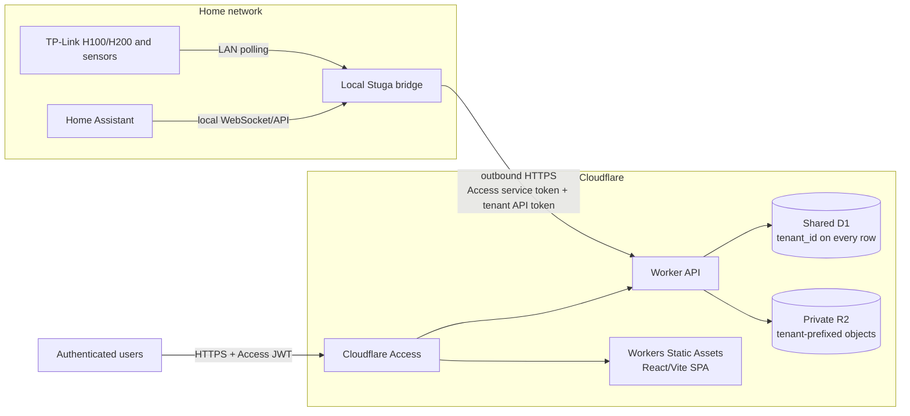

# Cloudflare hosting and multi-tenant operations

Stuga can run its hosted web and API tier on Cloudflare, including a
small multi-tenant deployment for up to ten users. It is not a lift-and-shift
of the existing Node.js API. The Cloudflare target is a Worker with Static
Assets, a shared D1 database, and an R2 bucket; LAN device integrations remain
on an outbound-only local bridge.

The expected light-use deployment can stay at **$0/month** on the current Free
tiers. A **$5/month Workers Paid** plan is the recommended production floor.
Budget **$5-$40/month** if traffic, compute, or storage becomes materially
larger than the assumptions below. A paid Cloudflare Access plan is a separate
exception: ten paid seats currently cost $70/month, so the estimate assumes the
Access Free plan.

No Cloudflare or GitHub resource was created, changed, or deployed while this
hosting implementation was prepared. The repository deliberately retains
placeholder resource IDs and Access settings until an operator completes the
bootstrap checklist.

## Chosen architecture



The repository's `cloudflare/wrangler.jsonc` serves `apps/web/dist` as Static
Assets, uses SPA fallback, and routes `/api/*` through the Worker before asset
handling. Static file requests do not consume Worker invocations; API requests
do. The `DB` binding points to D1 and `ASSET_BUCKET` points to R2.

The current Express/Node API cannot run on Workers unchanged. It depends on a
local filesystem and SQLite database, Python through `child_process`, LAN
discovery, persistent process timers, and process-local live-event state.
Workers currently exposes `node:sqlite` and `node:child_process` only as
non-functional compatibility stubs. See Cloudflare's
[Node.js compatibility matrix](https://developers.cloudflare.com/workers/runtime-apis/nodejs/).
The edge API therefore implements the portable hosted subset instead of
bundling `apps/api`.

### Hosted HTTP contract and local stdio MCP boundary

The Worker publishes its generated OpenAPI 3.1 document at
`/api/openapi.json` (with v1/v2 compatibility aliases) and the complete route,
authorization, token-scope, and MCP-parity inventory at
`/api/hosted-routes.json`. Both are generated from `cloudflare/src/routes.ts`,
and tests require a unique manifest entry and OpenAPI operation for every
declared route. These two contract endpoints contain no tenant data.

The hosted HTTP API is **not** a remotely exposed MCP server. The existing MCP
transport remains local stdio, so it does not acquire Cloudflare tenant
administration or accept untrusted Internet connections. Each hosted route has
an explicit `localMcp` classification:

| Classification | Meaning and intentional boundary |
| --- | --- |
| `equivalent` | Portable house, sensor, telemetry, weather, alert-rule, observation, parameter, and asset operations have a hosted HTTP equivalent. This describes functional overlap, not a one-to-one MCP tool name. |
| `hosted-only` | Access session, tenant selection, membership invitations, and tenant API-token administration exist only in the hosted HTTP control plane. They are deliberately absent from local stdio MCP. |
| `local-only` | TP-Link/Home Assistant discovery, credential configuration and connection tests, private-LAN device access, and thermal calibration/simulation stay in the local API/MCP runtime. Hosted compatibility routes return a boundary response, empty result, or `501`; they never perform the LAN/compute operation or accept those secrets. |
| `not-exposed` | Health/OpenAPI manifests, HTTP location helpers, and SSE compatibility endpoints are transport helpers and are not MCP tools. |

The route manifest is authoritative for this split. Adding a hosted route
requires choosing its authentication, tenant-bound API-token scope where
applicable, and local MCP relationship explicitly.

The Free-target asset endpoint deliberately accepts only base64 payloads up to
256 KiB. Parsing and decoding multi-megabyte JSON uploads cannot reliably fit
the configured 10 ms Free Worker CPU limit even though R2 itself can store much
larger objects. Compress small floor plans before upload. Larger models require
a future raw-streaming or signed direct-to-R2 upload flow (with the same tenant
authorization) and are not part of this Free deployment.

### Tenant isolation

One shared D1 database is intentional for this scale. The Free plan permits ten
databases, but a shared database avoids a binding/database per customer and
makes the ten-user case economical. D1 does not provide application row-level
security, so tenant isolation is an application invariant:

- Every tenant-owned row includes `tenant_id`. Primary keys, foreign keys, and
  query indexes include `tenant_id` at the left-hand side where practical.
- A verified Access subject is mapped through `users` to `tenant_members`.
  Email is mutable contact/invitation data, not the durable user key. A request
  may select only a tenant of which that subject is a member. A tenant ID
  supplied by a header, path, query string, or body is never authorization by
  itself.
- Local-bridge tokens are stored as hashes and resolve to exactly one tenant.
  The raw token is shown once and never stored in logs or returned by list APIs.
- Every read, write, update, delete, aggregate, and uniqueness check is scoped
  by the resolved `tenant_id`. Tests must include a second tenant and prove that
  guessed IDs cannot read, overwrite, delete, or infer its data.
- R2 object keys begin with an opaque tenant prefix, and the corresponding D1
  asset row contains the same `tenant_id`. The bucket remains private; downloads
  pass through an authorized Worker route rather than a public R2 URL.
- Authenticated API responses use `Cache-Control: no-store`. Shared cache keys
  must never mix tenant data.

The initial roles are `owner`, `admin`, and `member`. Role checks happen after
membership resolution. A user belonging to several tenants can choose among
those memberships, but cannot manufacture a new tenant context.

### Cloudflare Access is the identity perimeter

Create a self-hosted Access application for the complete production hostname,
not just `/api/*`, and allow only the intended users or identity-provider group.
The Access Free plan is large enough for ten people.

Access at the edge is necessary but is not sufficient. The Worker **must
validate** the JWT in `Cf-Access-Jwt-Assertion` on every tenant-bearing browser
API request (the health and contract-manifest routes carry no tenant data):

1. Fetch and cache the account JWKS from
   `https://<team>.cloudflareaccess.com/cdn-cgi/access/certs`.
2. Verify the RS256 signature and the `exp` and `nbf` time claims.
3. Require `iss` to equal the configured `TEAM_DOMAIN` exactly.
4. Require `aud` to contain the configured Access application `POLICY_AUD`.
5. Only then use the email/subject claims to resolve `tenant_members`.

Do not trust `Cf-Access-Authenticated-User-Email`, an email in a request body,
or a merely decoded JWT. Cloudflare explicitly recommends validating the header
token and its signature, issuer, and audience even when Access is in front of a
Worker. See [Validate Access JWTs](https://developers.cloudflare.com/cloudflare-one/access-controls/applications/http-apps/authorization-cookie/validating-json/).

If production uses a custom hostname, disable the public `workers.dev` route or
protect that hostname with an equivalent Access application. Otherwise the
alternate hostname can bypass the custom-domain Access policy. Fail closed when
`TEAM_DOMAIN`, `POLICY_AUD`, the assertion, or its required identity claims are
missing. A verified user with no membership is the sole exception: the
idempotent first-login path provisions that user's personal tenant.

The local bridge does not use an interactive Access session, but it still has
to pass the hostname-wide Access perimeter **before** the request reaches the
Worker. Give each bridge a Cloudflare Access service token and add a `Service
Auth` policy for those tokens to the same Access application (or to a more
specific ingestion-path application). Every upload sends both:

- `CF-Access-Client-Id` and `CF-Access-Client-Secret`, which authenticate the
  machine to Cloudflare Access; and
- `Authorization: Bearer stuga_...`, which the Worker hashes, resolves to one
  tenant, and checks for the `ingest` scope.

Use the two dedicated Access headers; do not configure Access's single-header
mode on `Authorization`, because that header is reserved for the tenant token.
The two credentials enforce different boundaries and neither replaces the
other. Store both only in the local bridge secret store, issue them per bridge,
rotate/revoke them independently, and never place them in D1 plaintext,
GitHub, browser storage, or logs. See [Cloudflare Access service tokens](https://developers.cloudflare.com/cloudflare-one/access-controls/service-credentials/service-tokens/)
and [Service Auth policies](https://developers.cloudflare.com/cloudflare-one/access-controls/policies/common-policies/#authenticate-a-service-using-a-service-token).

## Local TP-Link and Home Assistant boundary

The local bridge runs on a trusted always-on device in each home, such as the
existing Stuga host, a small computer, or a Home Assistant-adjacent
service. It owns all capabilities that require the private LAN:

- discover and poll H100/H200 hubs and T310/T315 children;
- connect to Home Assistant's local WebSocket/API;
- run the pinned `python-kasa` helper;
- keep TP-Link and Home Assistant credentials in the local secret store; and
- buffer samples while either the home Internet connection or Cloudflare is
  unavailable.

The Worker never scans a home network and never stores device-account
credentials. No inbound port, Cloudflare Tunnel, or public Home Assistant URL is
required for telemetry. The bridge initiates outbound HTTPS through Access to
the Worker, sends both machine and tenant credentials on every upload, retries
with bounded exponential backoff, and relies on the composite tenant, sensor,
and UTC bucket timestamp as the idempotency key.

The bridge may poll devices more frequently for local responsiveness, but it
uploads **one compact row per sensor per 10-minute UTC bucket**. All metrics for
that sensor and bucket are stored together in `values_json`/`units_json`. Do not
upload a row per metric or every unchanged 10-second poll; either pattern wastes
D1 writes and makes the Free-tier estimate invalid.

Hosted raw telemetry is retained for **30 days**. `INGEST_MIN_INTERVAL_SECONDS`
is `600` and `RAW_RETENTION_DAYS` is `30`. Cleanup must delete expired
`telemetry_samples` in bounded, tenant-safe batches and be monitored; setting a
variable alone does not enforce retention. Longer-term trends should use
hour/day aggregates rather than retaining more raw buckets. D1 deletion and
index maintenance also count toward rows written, so monitor steady-state usage
after day 30.

## Bootstrap a Cloudflare environment

Prerequisites are Node.js 22.13 or newer, a Cloudflare account, a Zero Trust
organization, and either the generated `workers.dev` hostname or a hostname in
a Cloudflare-managed zone. Run commands from the repository root unless a step
changes directory.

### 1. Install and validate locally

```powershell
npm ci
npm --prefix cloudflare ci
npm run typecheck
npm test
npm run build
npm --prefix cloudflare run typecheck
npm --prefix cloudflare test
npm --prefix cloudflare run deploy:dry-run
```

Regenerate `cloudflare/worker-configuration.d.ts` with
`npm --prefix cloudflare run types` whenever bindings change, then commit the
generated type update with the configuration change.

### 2. Create D1 and R2 once

Authenticate interactively only on the operator's workstation:

```powershell
Push-Location cloudflare
npx wrangler whoami
npx wrangler d1 create open-stuga
npx wrangler r2 bucket create open-stuga-assets
Pop-Location
```

Copy the returned D1 UUID into `cloudflare/wrangler.jsonc` in place of the
all-zero `database_id`. Confirm the D1 database and R2 bucket names are unique in
the selected Cloudflare account before creating them; do not overwrite an
unrelated resource with a matching name.

Apply the migration locally first, and then to the new remote database:

```powershell
npm --prefix cloudflare run migrate:local
npm --prefix cloudflare run migrate:remote
```

The migration creates the tenant, membership, tenant-bound token, domain-data,
compact telemetry, and R2 metadata tables. Future schema changes must be new,
forward-only migration files. Prefer expand/migrate/contract changes so both
the previous and next Worker versions remain compatible during rollback.

### 3. Configure Access before exposing the hostname

In Cloudflare Zero Trust, create a self-hosted application for the exact Worker
hostname and an allow policy for the intended identities. Copy:

- the team domain, including `https://`, to `TEAM_DOMAIN`; and
- the application's immutable Audience (AUD) tag to `POLICY_AUD`.

Neither value is a password, but both must be exact and must not remain
`CHANGE-ME`. Keep `AUTH_MODE=access`. Protect every route on the hostname and
remove or protect alternate Worker hostnames.

For each local bridge, also create an Access service token and a `Service Auth`
policy that includes that specific token. Prefer a more-specific Access
application for the ingestion paths when operationally practical; otherwise
the Worker remains the second enforcement layer and an ingest-only Stuga token
cannot read or administer tenant data. Do not use a `Bypass` policy. Cloudflare
evaluates Service Auth before interactive Allow policies, so machine uploads
and browser users can share the protected hostname safely.

For the generated hostname, use Workers & Pages > `open-stuga` > Settings >
Domains & Routes > `workers.dev` > **Enable Cloudflare Access**. Cloudflare can
protect the Worker directly by name, which covers every route; see
[Manage access to workers.dev](https://developers.cloudflare.com/workers/configuration/routing/workers-dev/#manage-access-to-workersdev).

### 4. Deploy once and provision the first owner

There is intentionally no unauthenticated public bootstrap endpoint. Use the
manual production workflow described below with `deploy=true` (or perform the
same migration/deploy commands from an authenticated operator workstation),
then sign in through the configured Access application.

On the first authenticated request, the Worker stores a one-way hash of the
stable Access subject, records the normalized email as mutable contact data,
and creates a deterministic personal tenant, owner membership, and starter
house when no membership exists. Authorization is keyed by the stable subject,
not by an unverified email header. Repeated first requests are idempotent.

An owner/admin can invite another normalized email to an existing tenant. When
that person first authenticates, the Worker binds the invitation to their
stable subject and deletes the pending invitation. If a person signs in before
being invited, they receive their own personal tenant and can later belong to
both tenants.

Create a separate random, scoped Stuga ingestion token for each local bridge
through the tenant-admin API. Store only the returned plaintext token on the
local bridge; the cloud database retains its SHA-256 hash. Pair it with that
bridge's separately issued Access service-token client ID/secret. Never reuse a
deployment token, either bridge credential, or one tenant token across bridges
or tenants.

### 5. Smoke-test before enabling automatic production deploys

Verify, at minimum:

- an unauthenticated browser is redirected or denied by Access;
- a valid Access user can load the SPA and only their tenant's data;
- a user from tenant A receives `403`/`404` for tenant B identifiers;
- a bridge is denied unless both its Access service-token headers and its
  tenant-bound Stuga bearer token are valid;
- an `ingest` Stuga token can write only to its bound tenant and cannot read or
  administer it;
- duplicate bucket uploads are idempotent;
- an asset upload/download is tenant-scoped and not publicly addressable;
- a sample older than the 30-day boundary is rejected or removed by cleanup;
- `TEAM_DOMAIN`/`POLICY_AUD` mismatches and forged headers fail closed; and
- Worker, D1 row, D1 storage, and R2 operation metrics remain within budget.

## GitHub deployment pipeline

`.github/workflows/deploy-cloudflare.yml` is the deployment workflow. It is
designed so validation can run without mutating Cloudflare:

- Pull requests and manual validation install both dependency trees, run the
  root typechecks/tests/build, run the edge typechecks/tests, and run a Wrangler
  deployment dry run. They do not apply remote migrations or deploy.
- A production run is allowed after a configured `main` update only when the
  repository variable `CLOUDFLARE_DEPLOY_ENABLED` is exactly `true`, or by
  `workflow_dispatch` only when the `deploy` input is explicitly `true`.
- The production job uses the `cloudflare-production` GitHub Environment and a
  deployment concurrency group so two schema/deployment jobs cannot race.
- It depends on the successful validation job, rebuilds the same commit,
  applies pending D1 migrations, and only then runs `wrangler deploy`.
  Configure environment reviewers if a human approval is required.
- Keep actions and Wrangler pinned and update them intentionally. A failed
  validation or migration prevents Worker deployment.

The production environment needs these GitHub Actions secrets:

| Secret | Purpose |
| --- | --- |
| `CLOUDFLARE_ACCOUNT_ID` | Selects the one Cloudflare account that owns the Worker, D1 database, and R2 bucket. |
| `CLOUDFLARE_API_TOKEN` | Non-interactive Wrangler credential, scoped to that account and deployment only. |

Create a dedicated least-privilege token rather than using the Global API Key
or a developer's interactive OAuth token. It needs Workers Scripts edit access
for deployment and D1 edit access for migrations. Add R2 Storage write only if
CI will create/configure the bucket; normal object access happens through the
Worker binding. Do not grant DNS, Access-policy, user, billing, or other-account
permissions unless the workflow is deliberately extended to manage them. The
[official GitHub Actions guide](https://developers.cloudflare.com/workers/ci-cd/external-cicd/github-actions/)
describes the account ID and API-token authentication model.

The following are configuration, not secrets, but must also be reviewed before
the production environment is enabled: the `CLOUDFLARE_DEPLOY_ENABLED=true`
repository variable, real D1 `database_id`, R2 bucket name, Worker/custom
hostname, `TEAM_DOMAIN`, `POLICY_AUD`, 600-second ingest interval, and 30-day raw
retention. Never put bridge tokens, Access service-token client secrets, device
credentials, or Access cookies in GitHub variables or workflow logs.

## Deploy and rollback runbook

For a normal release, merge a reviewed change to `main` after the Cloudflare
resource IDs, production environment, and secrets are configured. Alternatively
run the deployment workflow manually with `deploy=true`. After the job:

1. record the Git commit and Worker version ID from the job output;
2. test Access, `/api/v1/health`, a tenant-scoped read, and a disposable ingestion;
3. inspect Worker errors, CPU, D1 rows read/written, D1 size, and R2 operations;
4. verify that no alternate unprotected hostname reaches the API; and
5. keep the previous Worker version available until the observation window ends.

To roll back Worker code and its Static Assets, list deployments and activate a
known-good version:

```powershell
Push-Location cloudflare
npx wrangler deployments list
npx wrangler rollback <KNOWN_GOOD_VERSION_ID>
Pop-Location
```

Worker rollback does **not** roll back D1 data/schema, R2 objects, Access
policies, DNS, or secrets. Cloudflare keeps the 100 most recent Worker versions,
and an old version may be unusable if a required binding was deleted or the
schema is no longer compatible. See [Workers rollbacks](https://developers.cloudflare.com/workers/versions-and-deployments/rollbacks/).

If a migration or data write must be reversed, first stop writes, determine the
last known-good UTC time, and use D1 Time Travel deliberately. The Free plan has
a seven-day recovery window; Workers Paid has 30 days. For example:

```powershell
Push-Location cloudflare
npx wrangler d1 time-travel restore open-stuga --timestamp "2026-07-14T12:00:00Z"
Pop-Location
```

A Time Travel restore changes production data and can discard valid writes
after the selected time. Capture evidence, obtain operator approval, and verify
tenant counts and recent samples before reopening writes. R2 deletes are not
reversed by Worker or D1 rollback; use immutable object keys and retain source
backups for important floor plans/assets.

## Free-tier feasibility for up to ten users

The following limits were verified against Cloudflare's official documentation
on 2026-07-14. Cloudflare can change limits and pricing, so re-check the linked
pages before enabling billing or increasing ingestion frequency.

| Product | Current Free allowance relevant here | Failure/billing boundary |
| --- | --- | --- |
| Workers code | 100,000 invocations/day; 10 ms CPU/invocation; 128 MB memory | Free requests reset at 00:00 UTC; over-limit API requests fail instead of incurring overage. |
| Static Assets | Requests are free and unlimited; storage has no extra fee; 20,000 files/version; 25 MiB/file | Only routes that invoke Worker code are metered. |
| D1 | 5 million rows read/day; 100,000 rows written/day; 5 GB/account; 10 databases/account; 500 MB/database; 50 queries/Worker invocation; seven-day Time Travel | Reads/writes reset at 00:00 UTC and fail after the Free cap. Tables and indexes consume storage; index maintenance consumes writes. |
| R2 Standard | 10 GB-month/month; 1 million Class A operations/month; 10 million Class B operations/month; free Internet egress | Free tier does not apply to Infrequent Access. Billable units round up. |
| Cloudflare Access | $0 for up to 50 active-user seats | Ten people fit; paid pay-as-you-go is currently $7/user/month. |

Official sources: [Workers pricing](https://developers.cloudflare.com/workers/platform/pricing/),
[Workers limits](https://developers.cloudflare.com/workers/platform/limits/),
[Static Assets billing](https://developers.cloudflare.com/workers/static-assets/billing-and-limitations/),
[D1 pricing](https://developers.cloudflare.com/d1/platform/pricing/),
[D1 limits](https://developers.cloudflare.com/d1/platform/limits/),
[R2 pricing](https://developers.cloudflare.com/r2/pricing/), and
[Cloudflare Zero Trust pricing](https://www.cloudflare.com/plans/zero-trust-services/).

### $0 operating assumptions

The $0 conclusion is conditional on all of the following:

- Other applications in the same Cloudflare account/Zero Trust organization do
  not consume a material share of the account-level allowances or Access seats.
- At most ten active people use Access, well below its 50-seat Free allowance.
- At most ten tenants/users have ten sensors each: 100 sensors total.
- Each sensor produces 144 compact 10-minute rows/day. That is 14,400 new
  telemetry rows/day and 432,000 live raw rows at 30-day retention.
- Because D1 counts table and index maintenance, inserts plus steady-state
  retention deletes can consume several row writes per sample. The design must
  remain below 100,000 rows written/day in measured production usage; the
  14,400-row input leaves necessary headroom but is not permission to add
  per-metric rows.
- Indexed, bounded history reads stay below 5 million rows scanned/day. As a
  reference, 100 complete 24-hour chart loads per user per day across ten
  sensors return about 1.44 million telemetry rows total for ten users, before
  query/index overhead.
- Browser current-state polling is no faster than once per minute. Ten users
  then generate about 14,400 API requests/day; ten bridges uploading one batch
  per bucket add about 1,440/day. Normal settings/history calls still leave
  substantial room below 100,000 Worker requests/day.
- The Worker normally stays below 10 ms CPU/request. Avoid synchronous model
  fitting, large JSON transforms, or Python-equivalent computation at the edge.
- The complete D1 database, including indexes and non-telemetry data, stays
  below 500 MB. Measure actual page/storage use; 432,000 variable-size JSON rows
  are not guaranteed to fit if payloads are allowed to grow without bounds.
- Private floor plans and other objects stay below 10 GB-month, with fewer than
  1 million writes/list operations and 10 million reads/month in R2 Standard.
- Each inline asset is at most 256 KiB; R2's larger object limits do not relax
  the Worker's 10 ms JSON/base64 processing budget.
- Static SPA files stay below 20,000 files and 25 MiB each.

Alert at 70-80% of each daily/monthly allowance. Upgrade before a Free cap is
reached because Workers and D1 fail at the cap rather than charging a small
overage. User count alone is not a capacity measure: sensor count, retention,
poll frequency, query shape, payload size, and index count determine usage.

## Paid estimate: $5-$40/month

Workers Paid currently starts at $5/month and includes 10 million dynamic
requests plus 30 million CPU-ms/month. The associated D1 Paid allowances include
25 billion rows read, 50 million rows written, and 5 GB storage per month before
overage. R2 Standard and Access Free can still remain at $0 within their Free
allowances.

The current incremental rates are:

- Workers: $0.30/million requests above 10 million and $0.02/million CPU-ms
  above 30 million;
- D1: $0.001/million rows read above 25 billion, $1.00/million rows written
  above 50 million, and $0.75/GB-month above 5 GB;
- R2 Standard: $0.015/GB-month above 10 GB-month, $4.50/million Class A
  operations above 1 million, and $0.36/million Class B operations above
  10 million; Internet egress remains free.

For the ten-user assumptions above, the realistic paid total is approximately
**$5/month**. Treat **$40/month** as a conservative budget guardrail for an
unexpectedly chatty API, heavier Worker CPU, or substantial R2 operation/storage
growth, not as the expected bill. Configure Cloudflare notifications and review
usage weekly after launch.

This estimate excludes a custom domain registration, the local bridge host and
electricity, paid identity-provider features, support contracts, and external
weather/map services. Cloudflare Access pay-as-you-go is $7/user/month, so ten
paid Access seats would add **$70/month** and fall outside the $5-$40 range. Keep
Access Free for this small deployment unless its paid support, SLA, or longer log
retention is required.
