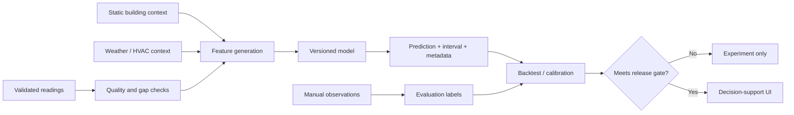

# Predictive maintenance and forecasting

Climate Twin supports forecasts as decision support, not as proof of a defect.
Temperature, relative humidity, and CO2 can reveal useful patterns, while the
registry can add other numeric evidence later. None of these alone proves hidden
water, mould, structural moisture, indoor-air quality, equipment condition,
occupancy, or a maintenance diagnosis.

## What the MVP forecast means

The v2 history/forecast surfaces use per-metric `MeasurementForecastPoint`
values: a point estimate plus low/high bounds for one sensor and registered
metric. A definition opts in with `forecastSupported`; an unsupported metric
shows no forecast rather than fabricated values. Forecasts must remain visually
distinct from observations and carry a generated-at time, horizon,
method/version, and uncertainty when the model layer exposes them. The v1
temperature/humidity forecast shape remains for compatibility.

The initial forecast is a transparent baseline suitable for UI development,
mock/replay tests, and alert-workflow experiments. It is not a validated
building-physics model. Do not automate costly maintenance, shut down heating,
or make health/safety decisions solely from it.

## Useful maintenance hypotheses

| Pattern | Possible hypothesis | Needed corroboration |
| --- | --- | --- |
| Humidity spike that decays slowly after a shower | weak extraction/ventilation | fan state, door/window state, outdoor absolute humidity, repeated events |
| Local humidity rises while adjacent rooms stay stable | leak or moisture source near sensor | direct inspection, leak sensor, moisture meter, manual observation |
| Window sensor repeatedly colder/more humid than hall sensor | thermal bridge, draft, or condensation risk | surface temperature, outdoor weather, window state, building survey |
| Whole zone cools despite heating demand | heating interruption or control fault | HVAC setpoint/state, energy use, boiler/heat-pump diagnostics |
| CO2 rises repeatedly while occupancy is likely | insufficient ventilation for the observed conditions | calibrated sensor, occupancy/door/window context, ventilation state, repeated events |
| CO2 or another channel becomes implausibly flat or jumps alone | sensor drift, communication, placement, or mapping issue | source timestamp/quality, neighbouring sensor, calibration/reference check |
| Sensor becomes flat, noisy, or unavailable | battery/radio/placement issue | battery entity, H200 diagnostics, comparison sensor, physical check |
| Persistent room-to-room gradient changes | airflow/HVAC balance or building-envelope change | ventilation settings, doors, outdoor conditions, maintenance timeline |

These are ranked prompts for investigation, not diagnoses. Manual leak,
condensation, mould, ventilation, and maintenance observations provide labels
for later evaluation but may be incomplete or subjective.

## Moisture and condensation limitations

T310/T315 humidity is ambient relative humidity. Relative humidity changes with
temperature even when the water-vapour amount is unchanged. Comparing rooms or
seasons is often better with derived dew point or absolute humidity, provided
the formula, sensor accuracy, and assumptions are documented.

Condensation occurs at a surface whose temperature is below the local dew point.
An ambient sensor does not know a window/wall/pipe surface temperature. A future
"condensation risk" feature should therefore be labeled an estimate unless a
surface sensor is present. A normal ambient reading also cannot rule out a
hidden leak inside a wall.

Consumer sensors drift and have response lag. Placement near radiators, direct
sun, exterior doors, kitchens, showers, or stagnant corners affects readings.
Record placement and moves; allow a settling period; compare against a reference
before interpreting small differences as building faults.

## A responsible prediction pipeline

Minimum engineering controls:

1. Use time-ordered training/validation/test splits; random row splits leak the
   future into the past.
2. Fit transformations on training data only. Preserve missingness and sensor
   replacement/move events rather than silently interpolating everything.
3. Compare to simple persistence and seasonal baselines. A complex model that
   cannot beat them should not ship.
4. Backtest separately by house, room type, season, scenario, and forecast
   horizon. Ten sensors in one house are correlated, not ten independent sites.
5. Report MAE/bias separately for every forecasted metric, interval
   coverage/width, alert precision/recall, lead time, and false alarms per week.
6. Version datasets, features, code/configuration, and model artifacts. Record
   model version with every stored forecast.
7. Monitor drift and calibration after sensor moves, firmware changes, HVAC work,
   and seasonal transitions.
8. Fall back to "insufficient data" when freshness, coverage, or model validity
   gates fail. Never fill uncertainty with false precision.

## Alerts versus predictions

Threshold alerts answer an observable question such as "humidity has exceeded
70% for 20 minutes" or "CO2 has exceeded a configured threshold." Predictive
alerts answer a model-dependent question such as "humidity is likely to remain
elevated." Keep separate rule types, messages, and audit fields. Thresholds are
site/policy configuration, not health claims embedded in measurement definitions.

A predictive alert should include:

- affected house/room/sensor and metric;
- observation cutoff and forecast horizon;
- predicted range/probability, not only a point value;
- model/version and data-quality status;
- the exact rule and lead time;
- an actionable, reversible verification step;
- feedback controls for useful/false/unknown and the eventual manual outcome.

Use hysteresis, minimum duration, cooldowns, deduplication, and escalation policy
to avoid alert fatigue. Do not retrain directly on "acknowledged" as if it means
"true incident."

## Mock and replay evaluation

Mock scenarios are deterministic, registry-aware fixtures for exercising
pipelines, not evidence of real-world model accuracy. Scenario definitions
should accept a seed and explicit parameters such as onset, duration, affected
rooms/metrics, gradients, missing readings, and recovery. An unknown custom
metric should remain "no data" unless the scenario explicitly generates it.

Replay is valuable for reproducible backtesting:

- pin the dataset and virtual-clock range;
- prevent replay from writing duplicate physical observations;
- route notifications only to a test sink by default;
- label every emitted event and forecast as replay;
- compare the prediction available at that historical cutoff, not one trained
  with later data.

## Safety and user communication

Predictions are not a substitute for smoke/CO alarms, certified leak detection,
professional mould/structural assessment, or manufacturer HVAC safety controls.
If there is visible water, electrical risk, freezing risk, a strong odour, or a
health concern, the UI should recommend immediate appropriate inspection rather
than waiting for the model.

Avoid a single opaque "house health" score. Show evidence, uncertainty, nearby
sensor comparisons, relevant observations, and why a suggestion appeared. The
user must be able to dismiss, correct, and export the reasoning trail.
